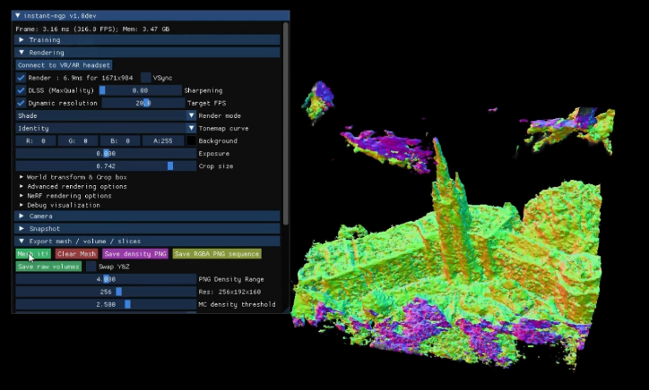

# On Demand Texturing and Interactivity with Generative AI and Neural Radiance Field (NERF)-like Models

## Project Overview
This project introduces a novel approach for generating realistic 3D models from image data, specifically aimed at enhancing VR environments. By leveraging advancements in Generative AI and Neural Radiance Field (NeRF)-like models, the project streamlines the creation of textured, immersive virtual worlds, with potential applications in gaming, architecture, and more.

## Motivation
With the growing demand for immersive VR experiences, there is a clear need for efficient tools to simplify 3D structure creation. Our project meets this need by using NVIDIA Lab’s Instant Neural Graphics Primitives (NGP) and Google Earth to transform real-world data into VR-compatible assets. This approach accelerates the VR development process, making it easier and faster to create realistic and detailed environments.

## Key Concepts
- **[Neural Radiance Fields (NeRF)](https://www.matthewtancik.com/nerf)**: A framework for synthesizing views of complex 3D scenes from sparse 2D images.
- **[Neural Graphics Primitives (NGP)](https://github.com/NVlabs/instant-ngp)**: A generative approach that optimizes rendering performance.
- **[COLMAP](https://colmap.github.io/)**: A photogrammetry tool used to reconstruct 3D structures from 2D images.
- **[Marching Cubes Algorithm](https://www.youtube.com/watch?v=M3iI2l0ltbE)**: A technique for constructing a high-resolution 3D surface from volumetric data.

## Development Objectives
1. **VR Environment Setup**: Design a VR-ready scene as the foundation for testing models.
2. **NeRF Model Integration**: Incorporate NeRF to create photorealistic, volumetric representations.
3. **Mesh Creation**: Implement mesh generation from image data.
4. **Performance Optimization**: Achieve VR compatibility with high frame rates, aiming for 60 fps.
5. **Scalability**: Ensure the architecture supports future expansion and refinement.

## System Requirements
- **Functional Requirements**
  - VR scene with realistic structures.
  - Texturing and wireframe generation using NeRF models.
  - Collision detection and VR performance optimization.
- **Quality Requirements**
  - Compatibility with VR headsets (tested on Meta Quest Pro).
  - Scalable design for large or complex datasets.

## Technologies Used
- **Programming Languages**: CUDA, C++, Python, C#.
- **Hardware**: GeForce RTX 4090, Meta Quest Pro VR headset.
- **Software and Libraries**:
  - Unity (for VR scene setup).
  - COLMAP (for 3D structure reconstruction).
  - Instant NGP by NVIDIA Labs (for NeRF modeling).
  - Tiny Cuda Neural Network, CMake, and Anaconda.

## Image Search
This project uses various datasets to test and refine the VR models. Each dataset is designed to provide different levels of detail and angles to improve model accuracy.
# Dataset Information

| Dataset             | Size        | Source                                                      | Processing         | Reconstruction Time | Verification Time | Model Information (Triangles/Vertices) | Notes/Concerns                                                                                       |
|---------------------|-------------|-------------------------------------------------------------|--------------------|---------------------|-------------------|----------------------------------------|------------------------------------------------------------------------------------------------------|
| **Temple of Time**  | 5 images    | 3 images, plus 2 flipped images for symmetry               | -                  | Instant             | -                 | Triangles: 213                        | Insufficient data for accurate modeling due to limited camera angles.                                |
| **Greek Temple**    | 47 images   | Captured from Lego modeling software Brick Link Studio      | Already cropped    | -                   | -                 | -                                      | Only 180° captured in COLMAP; symmetry likely impacted the accuracy of camera angle differentiation. |
| **Middlesex**       | 186 images  | 360° footage captured in Google Earth; snapshots with VLC   | Batch cropping     | 30.6 minutes        | 53.4 minutes      | Triangles: 23,873,472 / Vertices: 11,996,364 | Long processing time; optimizing dataset by focusing on main building reduces noise and time.        |

### Visualizations

  
  
  

## Image Preprocessing
Image preprocessing is crucial for the accuracy and quality of NeRF model training and rendering. Preprocessing steps include:

1. **COLMAP Camera Position Calculation**: Using COLMAP to determine the positions of cameras in each dataset, essential for NeRF model accuracy.
2. **LLFF Conversion**: Leveraging LLFF to convert COLMAP's output into a format readable by the NeRF model, allowing for structured data flow between software.

## Image Processing
This stage involves creating 3D structures from images using various techniques and tools:

1. **Automatic Reconstruction with Poisson Mesher**: Used to create a high-resolution mesh based on image data.
2. **Instant-NGP (NVIDIA)**:
   - Still relies on COLMAP for camera, image, and point data (.txt files).
   - Provides VR support and mesh exporting in vertex normals and vertex colors.
   - The Middlesex dataset processing took around 30 minutes, generating a detailed mesh with some noise.
3. **Mesh Processing and Exporting**:
   - **Challenges**: High-resolution models with over 5 million triangles introduce significant noise.
   - **Options for Improvement**: Downsampling reduces detail, so additional software like Blender or Unity shaders might be used to adjust color and refine the mesh.

  
  
<strong>Watch Demo Video on YouTube</strong>

## System Architecture
This project employs a modular system architecture for ease of testing and scalability. Key components include:
- **COLMAP** for capturing real-world data points.
- **Instant NGP** for NeRF-based model training.
- **Custom GUI** for exporting models and interacting with scene data.

## Impact and Limitations
### Impact
The project allows users to convert real-world structures into VR-ready 3D models easily. It shows promise in areas such as:
- Architecture and design visualization
- VR gaming and simulation
- Training and educational applications

### Limitations
- Lack of interior building traversal.
- Basic interface requiring refinement.
- Performance bottlenecks with larger datasets or higher complexities.

## Future Work
Planned enhancements include:
- Enabling interior modeling capabilities.
- Refining the user interface.
- Automating dataset generation.
- Optimizing training and processing times for improved performance.

## Lessons Learned
Throughout development, our team recognized the importance of iterative design, clear communication, and adaptability. User experience and system flexibility were also critical to successfully achieving our goals.

## Acknowledgments
Special thanks to Dr. Brent Davis for his mentorship and guidance, as well as Dr. Katchabaw for providing development resources.

---

